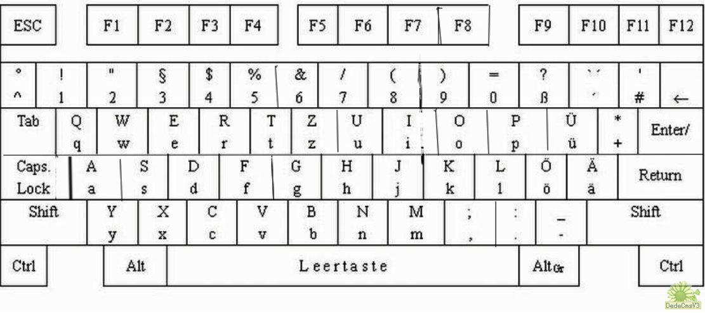

# 键盘布局


# debian上如何输入⸚
`````
1，CTRL+Shift+u 2e1a  Enter
2，在character map功能中找到，复制粘贴即可

https://german.stackexchange.com/questions/4880/how-to-type-umlaut-over-a-dash-as-in-many-german-dictionaries
`````
